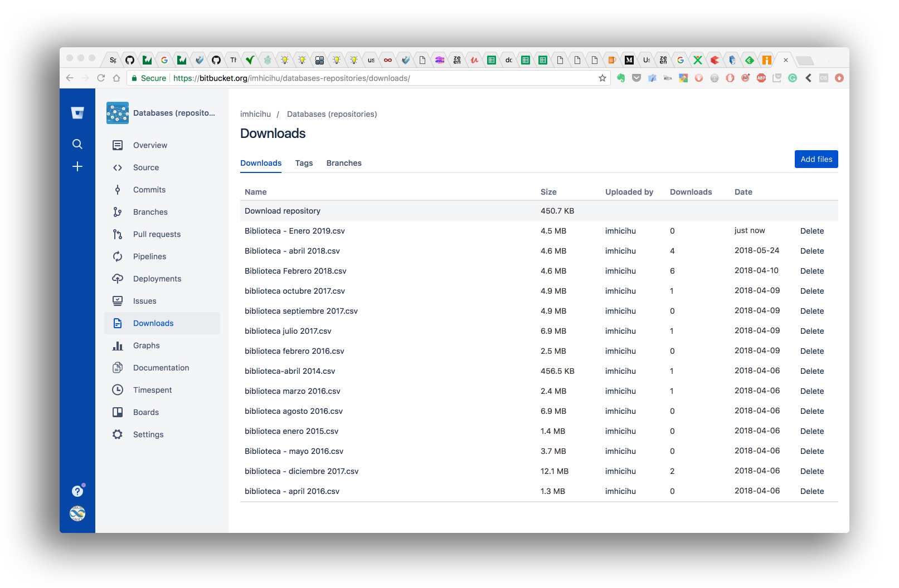

## Rationale

* Here, it will be found all the databases with bibliographic data created/curated/enhanced by IMHICIHU's library
* In some minor cases, a mere template for future databases with a focus in compatibility between operating systems, bibliographical formatting, language-codes and inter-exchange between open/closed software
* And lastly -courtesy by _Bitbucket_- a way to have a redundant copy of all the databases in just one place
* All of them are in `.csv UTF-8` format to minimize incompatibilities
* Find them in the [Downloads](/downloads/) folder

